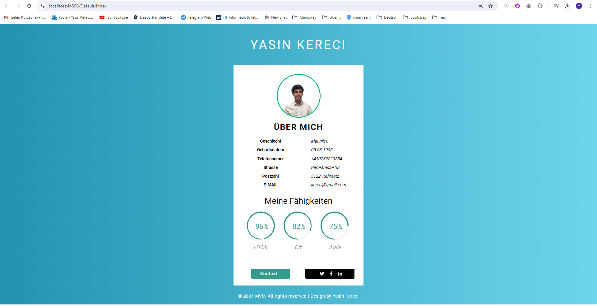

# Statische MVC-Lebenslaufseite

Dieses Projekt ist eine statische Lebenslaufseite, die in C# unter Verwendung des MVC (Model-View-Controller) Musters erstellt wurde. Es wurde eine vorgefertigte statische Vorlage verwendet und Anpassungen daran vorgenommen.

## Projektinhalt

- Statisch gestaltete Lebenslaufseite
- Erstellt mit der MVC-Architektur
- Anpassbare Felder für persönliche Informationen und Berufserfahrung
- Responsives Design, das für mobile Geräte optimiert ist

## Herunterladen und Entwickeln des Projekts

Sie können das Projekt über den folgenden Link herunterladen und nach Ihren Bedürfnissen weiterentwickeln:

[Projekt über Yandex Disk herunterladen](https://disk.yandex.com.tr/d/UPFpSA0fMGODIw)

## Installation

1. Laden Sie das Projekt herunter.
2. Öffnen Sie das Projekt mit Visual Studio oder einer ähnlichen IDE.
3. Nehmen Sie Anpassungen mit Ihren eigenen Informationen vor.
4. Führen Sie das Projekt aus, um die Änderungen zu testen.

## Screenshot

